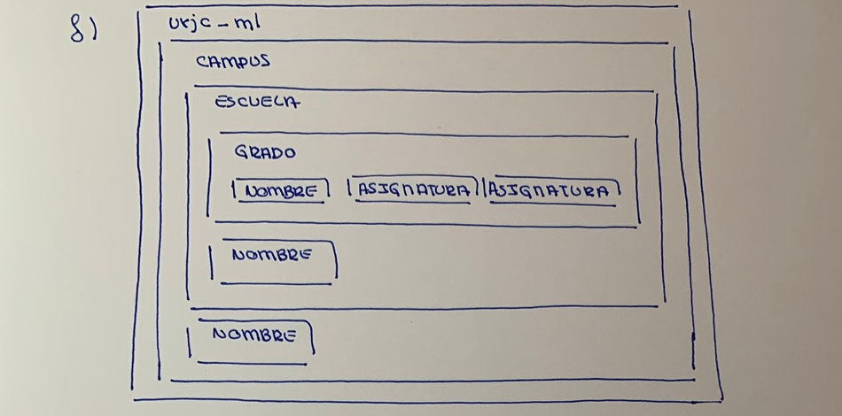
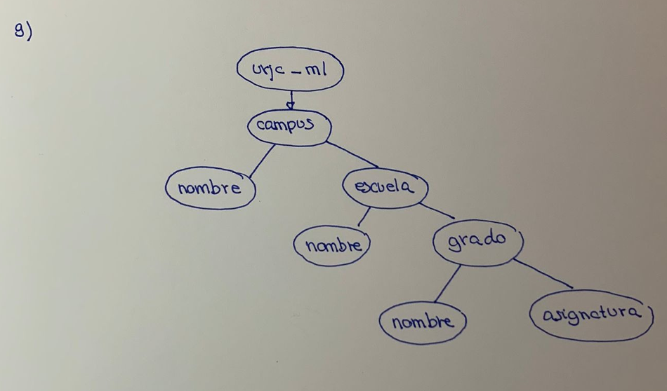
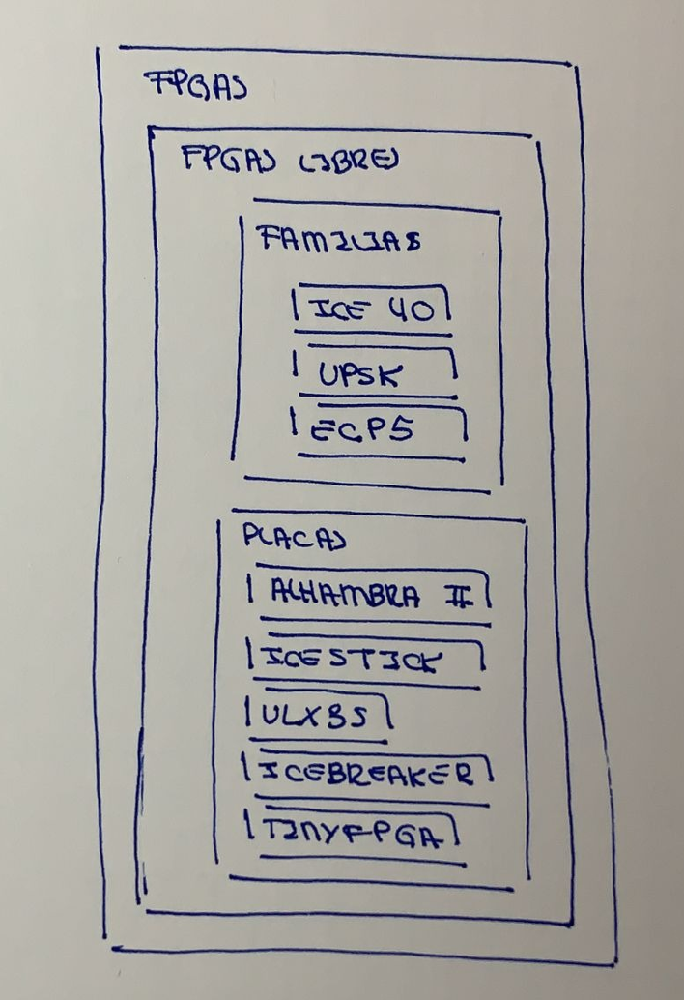
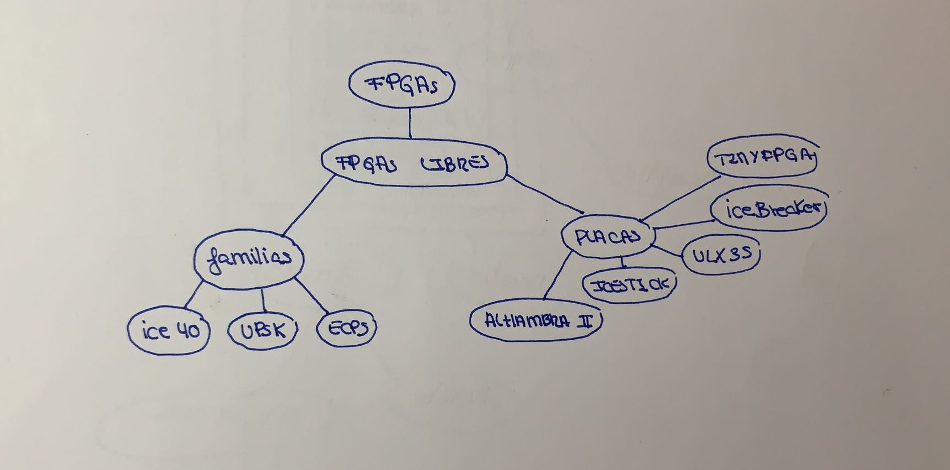

# Ejercicio 1 

**a) Explica para qué sirve la primera línea del documento y por qué es necesaria**

Sirve para indicar el fichero donde está la definición del lenguaje usado

**b) Si se omitiese esta línea, ¿Qué piensas que ocurriría?**

Las herramientas no serán capaces de realizar su trabajo si no saben qué tipo de documento utilizamos.

**c) Sin conocer el contenido del fichero urjc_ml.dtd, ¿el documento es sintácticamente correcto?**

Sí

**d) ¿Qué hace la tercera línea?**

Nada, es un comentario 

**e) ¿Cuantas etiquetas de apertura hay? ¿Cuantas de cierre?**

9 de apertura y 9 de cierre 

**f) Dibuja el diagrama de contenedores de este documento**

**g) Dibuja la estructura en árbol que define este documento**

# Ejercicio 2

<! DOCTYPE Universidad "universidad.dtd">
<universidad>
  <escuela>
      <nombre>ETSI Telecomunicación</nombre>
      <grado>
        <nombre>Ingeniería en Sistemas Audiovisuales y Multimedia </nombre>
        <asignatura>LTAW</asignatura>
        <asignatura>CSAAI</asignatura>
        <asignatura>ASA II</asignatura>
        <nombre>Ingeniería en Robótica Software</nombre>
        <asignatura>AC</asignatura>
      </grado>
    </escuela>
</universidad >

# Ejercicio 3

<!DOCTYPE Generic "generic.dtd">
<Generic>
  <contenedor>
      <nombre>Texto 5</nombre>
      <conetendor>
        <nombre>Texto 3 </nombre>
        <conetendor>
        <nombre>Texto 4 </nombre>
        <conetendor>
        <nombre>Texto 2 </nombre>
        <conetendor>
        <nombre>Texto 1 </nombre>
        <conetendor>
        <conetendor>
        
</contenedor>
 </contenedor>
</contenedor>
</Generic>

# Ejercicio 4

